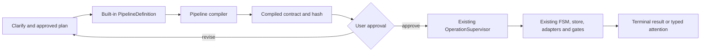

# LLM Obsidian 2.4 — Typed Pipeline Composition

> [!abstract] Решение
> 2.4 добавляет тонкий типизированный слой композиции поверх harness 2.3.
> Релиз не создаёт новый orchestration engine, FSM, supervisor, CLI или
> telemetry path. Additive controller/step receipts расширяют существующее
> harness state, не создавая второй store. Пользователь согласовывает задачу и
> скомпилированный контракт до запуска; после запуска harness работает
> автономно в утверждённых границах.

## Контекст

Harness 2.3 уже владеет durable operation state, write-ahead effects,
revision-CAS, бюджетами, provider/capability adapters, cmux lifecycle,
reconcile/resume/doctor, review gate и typed escalation. Однако отдельные
workflow-модули повторяют один и тот же управляющий скелет:

`spec → preflight → effects → gate → attention/terminal`.

2.4 закрывает только этот композиционный пробел. Общие инженерные практики
Superpowers и Matt Pocock skills используются как task semantics — design,
systematic debugging, TDD, verification и review — без привязки к GitHub
Issues, Shoes или другим конкретным внешним инструментам.

## Цели

1. Представить встроенный pipeline как типизированную композицию существующих
   harness-примитивов.
2. Статически проверять pipeline до запуска и связывать его точный hash с
   `OperationSpec`.
3. Показывать пользователю короткий compiled contract вместо сырой программы.
4. После одного подтверждения выполнять routine orchestration автономно.
5. Обкатать слой на существующем lifecycle и одном пользовательском
   engineering pipeline.
6. Сохранить один источник истины для исполнения: code-owned pipeline registry.
7. Сделать каждый semantic/effectful step отдельной durable operation, чтобы
   multi-step replay не зависел от единственного effect slot в
   `OperationRecord`.

## Не-цели

- новый workflow engine, scheduler, store, FSM, supervisor или CLI;
- пользовательские YAML/JSON pipeline-файлы;
- model-generated custom pipelines;
- произвольный Python, shell или callbacks внутри definition;
- `parallel`/`join` до формализации lane, cmux и single-writer semantics;
- превращение `reap` в свободно компонуемый task-side primitive;
- чтение wiki-страниц как authoritative runtime state;
- интеграции с GitHub Issues, Shoes или marketplace workflows.

## Роль пользователя

Пользователь участвует до запуска:

1. уточняет задачу и существенные продуктовые решения;
2. выбирает предложенный built-in pipeline и его профиль;
3. согласовывает план, проверки, review policy и stopping conditions;
4. подтверждает compiled contract.

После подтверждения harness не задаёт routine-вопросов. Retry, review loops,
context reconstruction, cmux surface churn, reconcile, recovery и допустимый
mechanism auto-repair выполняются автоматически внутри frozen envelope.

### Compiled contract

Перед подтверждением пользователь видит:

- pipeline id, profile, version и definition hash;
- последовательность смысловых этапов;
- максимальное число model/review/verification попыток;
- worst-case token/deadline/restart budget;
- полный класс возможных side effects;
- permission delta относительно code-owned policy ceiling;
- для каждого permission/side effect — enforceable binding и пометка
  `sandbox-enforced` либо `policy-only`;
- runtime/model routes и capability result;
- точные категории возврата к пользователю.

Пользователь подтверждает отклонения и пределы, а не читает внутренний IR.

## Архитектурная граница

Новый слой располагается внутри `scripts/harness/` и компилируется в уже
существующие `OperationSpec` и workflow operations.

Нельзя создавать параллельные реализации уже существующих механизмов.
`OperationSupervisor`, state machine, store, task sessions, review gate,
capability reports и runtime adapters остаются единственными владельцами своих
инвариантов.

### Operation и session mapping

Pipeline не исполняет несколько semantic/effectful steps внутри одного
`OperationRecord`: существующий record хранит только один active/resolved effect
slot и digest одного принятого callback.

- Каждый `model_step`, effectful `verify` и внешний workflow step компилируется
  в отдельный `OperationSpec` с derived lane/run identity.
- Typed one-shot model output использует parent session + deterministic child
  round по образцу review transport.
- Worktree-bearing semantic work использует существующий dispatch/provider
  session contract.
- Surface принадлежит step operation и проходит прежний reconcile,
  close-after-exit и exact-surface cleanup.
- Pipeline controller хранит только графовый прогресс и typed step receipts;
  provider/process lifecycle остаётся у существующего runtime manager.
- Worst-case pipeline budget равен сумме immutable per-operation envelopes,
  умноженных на статические пределы `bounded_loop`.

## Типизированная модель

### `PipelineDefinition`

Code-owned frozen dataclass содержит:

- `pipeline_id` и semantic version;
- профиль built-in pipeline;
- требуемые версии зарегистрированных primitives;
- упорядоченный control flow;
- типизированные input/output schemas;
- context requirements;
- route и capability requirements;
- budgets и review policy;
- permission ceiling и side-effect classes;
- execution/session mode каждого semantic step;
- declared human gates;
- terminal и attention outcomes.

В 2.4 definitions авторятся только в Python и не являются публичным DSL.

### `CompiledPipeline`

Compiler создаёт immutable представление:

- canonical serialized definition;
- definition SHA-256;
- resolved primitive versions;
- resolved route capabilities;
- статический worst-case budget;
- статический side-effect и permission summary;
- decision/output schemas;
- compatibility result с текущей версией harness.

Hash compiled definition связывается с `OperationSpec` по тому же принципу,
что уже используется для routing, approved plan и verification profile digest.

## Primitive registry 2.4

Минимальный registry:

- `model_step` — semantic work с обязательным output schema;
- `verify` — выполнение зарегистрированного verification profile;
- `review` — обёртка над существующим review gate;
- `human_gate` — initial echo-confirm или durable attention boundary;
- `bounded_loop` — повторение с code-owned retry/verification budget.

`decision` не является отдельным исполняющим механизмом: это `model_step` с
ограниченным typed output, который выбирает только заранее разрешённый переход.

`review` является composite primitive и сам владеет same-session verification
по `VERIFY_BUDGETS`. Pipeline-level `bounded_loop` не может охватывать review
re-entry; compiler считает review rounds из frozen review policy, а не из
внешнего loop limit.

`reap` остаётся coordinator-owned terminal transaction. Pipeline может прийти
к reap-ready состоянию, но не получает произвольного права выполнить reap.

## Built-in proof-of-use

### 1. Lifecycle composition

Существующий `dispatch → review → reap-ready` выражается через новый registry,
не меняя его пользовательское поведение, permissions и cleanup semantics.

Цель — доказать, что composition layer переиспользует существующий kernel и
устраняет повторяющийся управляющий код.

### 2. Engineering pipeline

Один пользовательский built-in `engineering` имеет два утверждаемых профиля:

- `change`: approved design/plan → TDD slices → verify → review → reap-ready;
- `fix`: reproduce → root cause → regression test → minimal fix → verify →
  review → reap-ready.

Clarify/design происходят до запуска и формируют approved plan. Pipeline не
может самостоятельно расширить согласованный scope. Документация, рефакторинг
и skill-improvement используют ближайший профиль с явно согласованными
verification rules через существующий bounded `compose_commands`, а не создают
отдельный pipeline автоматически.

## Compiler checks

Compiler обязан fail closed при любом из условий:

- неизвестный primitive или несовместимая primitive version;
- неразрешённый переход, цикл вне `bounded_loop` или неполный terminal path;
- budget, который нельзя вычислить статически;
- permissions или side effects вне code-owned ceiling;
- permission/side-effect class без binding к enforceable механизму:
  `harness.toml`, adapter sandbox/permission flags, workspace roots либо
  coordinator-owned chokepoint (`reap`, `vault-write`);
- runtime route без требуемой capability;
- несовместимый input/output schema;
- context input без bounded pointer/hash;
- попытка использовать wiki content как mutable control state;
- definition hash или approved plan hash не совпадает при resume.

Compiler рассчитывает worst-case с учётом всех bounded loops. Capability
validation выполняется для каждого resolved route. Approval renderer не может
называть policy-only утверждение sandbox-enforced; requested capability без
enforceable binding fail closed.

## Replay и repair semantics

- Pipeline controller использует staged-operation pattern из research workflow:
  каждый semantic/effectful step — отдельная operation.
- Additive controller state под `.vault-meta/harness/` фиксирует завершённые
  step ids и ссылки на receipts; `OperationRecord` и его single-effect schema
  не превращаются в multi-effect store.
- Новый per-step output receipt сохраняет content hash, schema version,
  definition hash, step id и input hash; raw prompt в ledger не попадает.
- Replay key: `definition_hash + step_id + input_hash + schema_version`.
  Только точное совпадение позволяет переиспользовать accepted typed output без
  повторного model call.
- Side effects остаются write-ahead и idempotent через существующий supervisor.
- Compiled definition нельзя менять во время run.
- Допустимый mechanism repair создаёт новую definition/version и новый run,
  сохраняет `predecessor_definition_hash` и может переиспользовать receipt по exact
  key предшественника только когда primitive id/version и input/output schemas этого
  step не изменились между definitions. Уже завершённые idempotent effects требуют
  доказанной identity; state converters не добавляются.
- Недопустимый или неоднозначный repair паркует operation в durable attention.

## Возврат к пользователю

Возврат разрешён только через типизированные множества:

1. объявленный `human_gate`;
2. существующие escalation categories: scope, security, public interface,
   migration, permission, новый или неоднозначный external effect, contract
   drift, blocking review; запрос новой dependency отображается на permission
   и/или external-effect, а не вводит несуществующую категорию;
3. terminal `AttentionReason`: исчерпание retry/verify/token/deadline/restart
   budget, callback timeout, capability mismatch, runtime unavailable, surface
   loss или incomplete cleanup;
4. mechanism failure, не проходящий auto-repair boundary.

Возврат оформляется как durable decision packet: решение, варианты, минимальный
контекст и сохранённая safe boundary.

## Хранение и wiki

- Code-owned definitions и registry живут в Git рядом с harness.
- Authoritative execution ledger остаётся в `.vault-meta/harness/`.
- Pipeline controller и per-step receipts являются additive harness state,
  versioned и owner-scoped; это не отдельный store.
- Compiled runtime artifacts являются derived state и восстанавливаются по
  definition/hash.
- Wiki хранит каталог, объяснение, диаграммы и результаты dogfooding.
- Wiki-страницы никогда не управляют активным control flow.
- Content-free telemetry может писать только identifiers, versions, hashes и
  числовые counters; prompts, решения и page bodies запрещены.

## Наблюдаемость

Существующий `docs/pipeline-observability.md` расширяется следующими
content-free измерениями:

- pipeline id/version/profile;
- compiler outcome;
- built-in definition hash;
- primitive counts и bounded-loop iterations;
- terminal/attention category;
- escalations и auto-close misses на completed task.

Изменение telemetry schema не должно менять результат pipeline при ошибке
записи.

## Acceptance criteria

### Контракты

- Все built-ins проходят один и тот же compiler.
- Canonical definition даёт стабильный hash.
- Любое изменение semantics primitive меняет совместимость или version.
- Неизвестные primitives, unbounded cycles и permission escalation отвергаются.
- Permission/side-effect class без enforceable binding отвергается.
- Worst-case budget и side effects вычисляются до approval.
- Capability mismatch обнаруживается до provider launch.

### Исполнение

- Lifecycle composition проходит hermetic tests без второго store/FSM/CLI.
- Оба engineering profiles проходят happy path и typed escalation path.
- Crash/reconcile не повторяет принятый `model_step` с exact replay key или
  завершённый idempotent side effect.
- Review budget и same-session verification сохраняют текущую семантику.
- Reap остаётся coordinator-owned и выполняется только после exact evidence.
- Existing harness, vault и acceptance suites остаются зелёными.

### UX

- До approval не создаётся worktree, provider session или внешний effect.
- Approval card помещается в один bounded summary.
- После approval routine execution не требует пользователя.
- Любой возврат содержит typed decision packet.

### Dogfood

- Не менее 10 завершённых реальных задач через compiled built-ins.
- Представлены оба runtime directions, оба engineering profiles, simple/deep
  review и хотя бы одна deliberate escalation.
- Нет unresolved callback failures или auto-close misses перед релизом.

## Стоп-критерий Fable

Критерий оценивается после shadow parity lifecycle + обоих engineering profiles
и до переключения production path.

Executor сохраняет в ADR два числа:

- `added_non_test_loc`: новые non-test LOC IR/compiler/registry/controller;
- `deletable_non_test_loc`: non-test LOC повторяющегося control skeleton,
  которые parity evidence разрешает удалить из всех built-ins этой
  спецификации.

Composition migration продолжается только если
`deletable_non_test_loc > added_non_test_loc`; compiler/IR/registry
амортизируются по lifecycle и обоим engineering profiles, tests не входят ни в
одно число. Если порог не достигнут или ясность ухудшается, production
переключение отменяется: сохраняется только минимальный registry/compiled
contract slice, прошедший отдельный net-value review, а harness 2.3 признаётся
достаточным pipeline engine.

## Rollout и rollback

1. Ввести IR, registry, controller receipts и compiler без переключения
   production paths.
2. Пропустить lifecycle, engineering definitions и существующий staged
   research workflow через shadow validation.
3. Получить parity evidence и записать числовой стоп-критерий.
4. Только при прохождении критерия переключить lifecycle composition.
5. Обкатать engineering profiles и провести dogfood acceptance window.
6. Удалять старый дублирующий orchestration только после полного parity
   evidence.

Rollback отключает compiled dispatch path и возвращает встроенные workflows к
предыдущему entrypoint. `OperationRecord` schema, active operation state и wiki
не требуют конвертации; additive controller/receipt files остаются
игнорируемым versioned state.

## Deliverables

- internal typed IR и primitive registry;
- compiler, canonicalization и definition hashing;
- additive pipeline controller и per-step typed receipt ledger;
- compiled-contract renderer;
- binding в существующий `OperationSpec`;
- lifecycle и engineering built-ins;
- shadow validation существующего research staged-operation pattern;
- hermetic contract/integration tests;
- observability extension и dogfood report;
- обновлённые skill/docs entrypoints;
- ADR о границе composition layer и запрете второго engine.

## Переход к 2.5

2.5 не начинается, пока compiler не прошёл release gate 2.4 и dogfood window.
Следующий этап описан в
[[2026-07-30-224926-llm-obsidian-2-5-model-authored-custom-pipelines]].
