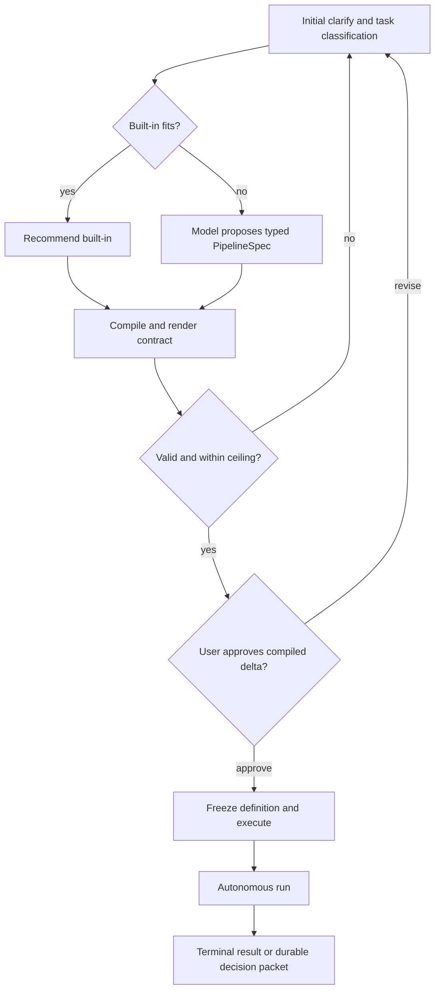

# LLM Obsidian 2.5 — Model-Authored Custom Pipelines

> [!abstract] Решение
> 2.5 разрешает модели предложить custom pipeline во время начального
> clarify/design, но только как ограниченный typed `PipelineSpec`. Spec проходит
> compiler 2.4, сравнивается с code-owned policy ceiling и явно подтверждается
> пользователем до запуска. Модель не получает права создавать исполняемый
> Python, shell, новый primitive или собственные permissions.

## Зависимость от 2.4

2.5 является развитием
[[2026-07-30-224926-llm-obsidian-2-4-typed-pipeline-composition]], а не
параллельным engine.

Работа над 2.5 начинается только если:

- built-in definitions исполняются через единый compiler;
- lifecycle и engineering pipelines прошли release acceptance;
- собрано не менее 10 реальных completed tasks;
- definition hashing, replay и capability checks доказаны;
- per-step operation/controller receipts 2.4 доказали crash/reconcile без
  duplicate model/effect execution;
- permission ceiling и worst-case budget покрыты hermetic tests;
- telemetry не показывает unresolved callback failures или auto-close misses;
- стоп-критерий Fable не отклонил composition layer.

## Цели

1. Позволить модели собрать task-specific pipeline из зарегистрированных
   primitives после обсуждения задачи с пользователем.
2. Сохранить минимальную роль пользователя после initial approval.
3. Сделать custom pipeline столь же проверяемым и replayable, как built-in.
4. Не позволить task content или prompt injection расширить permissions.
5. Создать безопасный путь promotion повторяемого custom pipeline в built-in.

## Не-цели

- генерация или исполнение arbitrary Python/shell;
- загрузка plugins, dependencies или primitives из task context;
- пользовательский marketplace pipelines;
- editable wiki/YAML как runtime control plane;
- неограниченные циклы, recursion или dynamic graph mutation;
- `parallel`/`join` без отдельного доказанного resource/lane design;
- автоматическое расширение permission, security или external-effect boundary;
- изменение compiled spec во время активного run;
- замена built-in pipelines там, где они уже удовлетворяют задаче.

## Пользовательский сценарий

Пользователь не пишет DSL вручную. Модель рекомендует built-in, если он
эквивалентен задаче; custom spec появляется только при доказанном semantic gap.

## `PipelineSpec`

`PipelineSpec` — versioned declarative object с canonical JSON schema. Он
содержит только:

- intent и выбранный task profile;
- ссылки на registered primitive id/version;
- ограниченный control flow;
- typed inputs, outputs и transitions;
- bounded budgets и loop limits;
- route aliases и capability requirements;
- context pointers с size/hash bounds;
- requested side-effect classes;
- schema-constrained bounded extra verification checks, компонуемые только
  через существующий `compose_commands`;
- review/verification policy;
- declared human gates и terminal outcomes.

Spec не содержит команды, исходный код, произвольные filesystem paths, model
provider credentials, runtime argv или инструкции по обходу policy.

Raw spec хранится в owner-only runtime scratch. Authoritative run связывает
canonical compiled hash; content-free telemetry видит только id/version/hash и
числовые counters.

## Authoring protocol

1. `clarify` формирует task contract и существенные решения.
2. Deterministic code-owned pipeline selector сравнивает задачу с built-in
   registry; модель не выбирает baseline.
3. При semantic gap model step предлагает `PipelineSpec` по JSON schema.
4. Parser отвергает любой unknown или лишний field.
5. Compiler 2.4 выполняет validation, capability resolution, budget expansion,
   permission comparison и canonical hashing.
6. Contract renderer показывает пользователю смысловую последовательность,
   deterministic built-in delta и absolute worst-case относительно global
   default ceiling.
7. Только explicit approval создаёт frozen `CompiledPipeline` и operation.
8. Harness исполняет definition существующим supervisor/FSM/store.

Модель, предложившая spec, не может подтвердить его от имени пользователя или
изменить code-owned policy ceiling.

## Ограничения custom composition

В 2.5 разрешены только:

- последовательные registered steps;
- schema-constrained decision transitions;
- code-bounded loops;
- существующие review/verification gates;
- durable human gates;
- terminal handoff в coordinator-owned lifecycle.

Числовые пределы количества nodes, loop depth, iterations, model calls,
verification rounds, deadline и token budget задаются code-owned constants.
Spec может запросить только меньшее или равное значение.

`parallel`/`join` остаются за пределами 2.5. Их добавление требует отдельного
дизайна для FIFO lanes, ограниченных cmux surfaces, provider quotas и
single-writer vault transactions.

## Security invariants

### Permission ceiling

`requested_permissions ⊆ code_owned_ceiling` — без исключений. Source files,
retrieved context, model output и raw spec не могут изменить ceiling.

Каждый declarable permission/side-effect class обязан иметь code-owned binding
к enforceable механизму: `harness.toml` profile field, adapter
sandbox/permission flag, workspace root либо coordinator-owned chokepoint вроде
`reap`/`vault-write`. Class без binding не является «policy-only разрешением» —
compiler отвергает spec.

Compiler обязан отдельно показывать:

- filesystem write roots;
- network/external-effect classes;
- provider/runtime routes;
- destructive и publish/deploy capabilities;
- новые зависимости или credentials.

Любой запрос вне ceiling возвращает spec в clarify и не создаёт operation.
Approval card помечает каждую строку как `sandbox-enforced` либо `policy-only`
constraint и никогда не представляет policy-only обещание как технически
enforced capability.

### Prompt-injection boundary

- Task context является untrusted input.
- Context не может определять primitive id, permission policy или compiler
  behavior вне schema fields.
- Unknown fields, encoded commands и unbounded pointers fail closed.
- Model output проходит schema validation до любого effect.
- Compiler и policy evaluation являются code-owned и model-independent.

### Approval without consent theater

Пользователь видит не raw JSON, а:

- отличие от baseline, выбранного только deterministic code-owned selector;
- абсолютный worst-case относительно global default ceiling независимо от
  relative delta;
- worst-case model/review/verification calls;
- side effects и permissions;
- loop/stopping conditions;
- reasons for return;
- routes и capability evidence.

Слишком сложный для bounded summary spec должен быть отклонён или разделён, а
не подтверждён как непрочитанная программа.

## Determinism и replay

- Canonical spec, primitive versions и compiler version входят в hash.
- Outputs model steps фиксируются per-step receipt из 2.4 по exact replay key:
  definition hash + step id + input hash + schema version.
- Decision переход воспроизводится из принятого output, а не повторным вызовом
  модели.
- Effects используют отдельные step operations, существующий per-operation
  write-ahead effect slot и additive pipeline controller receipts 2.4.
- Resume требует точного compiled hash и compatible primitive semantics.
- Любое изменение spec создаёт новую version/run; active definition immutable.
- Failed custom run паркуется на safe boundary. Repair не переписывает историю.

## Возврат к пользователю

Custom pipeline использует те же typed conditions, что built-ins 2.4:

- declared human gate;
- scope, security, public-interface, migration, permission, external-effect,
  contract-drift или blocking-review escalation; новая dependency отображается
  на permission и/или external-effect;
- exhausted budgets;
- capability/runtime/surface/callback/cleanup attention;
- mechanism failure вне auto-repair contract.

Model uncertainty сама по себе не является причиной интерактивного вопроса.
Она должна сводиться к разрешённому typed decision, bounded retry или durable
decision packet.

## Promotion в built-in

Повторяемый custom pipeline не становится code-owned автоматически.

Promotion требует:

1. нескольких успешных runs с одинаковым normalized fingerprint;
2. доказанной пользы относительно ближайшего built-in;
3. отсутствия новых unresolved escalation patterns;
4. ручного design/TDD изменения registry;
5. hermetic tests и обычного review gate;
6. новой semantic version и wiki catalog entry.

Raw task content и model prompts не копируются в promoted definition.

## Observability

Разрешённые content-free события:

- custom/built-in classification;
- spec schema/compiler version;
- normalized definition hash;
- node/loop/model-call numeric counts;
- compile rejection category;
- approval/revision count;
- terminal/attention category;
- promotion-candidate fingerprint count.

Запрещены intent text, prompt, raw spec body, decisions, file contents,
commands, errors и credentials.

## Failure modes

| Риск | Обязательная защита |
|---|---|
| Модель запрашивает дополнительные права | Code-owned subset check + enforceable binding |
| Spec bomb через граф или loops | Static node/depth/budget limits |
| Primitive semantics изменились | Primitive semver и compatibility check |
| Route не поддерживает capability | Compile-time `CapabilityReport` |
| Replay повторяет model/effect | Output hash и write-ahead ledger |
| Approval превращается в rubber stamp | Delta summary и complexity rejection |
| Custom catalog дублирует skill router | Registry — единственный executable catalog |
| Wiki становится control plane | Runtime scratch + compiled hash authoritative |
| Repair мутирует активную программу | New definition/version/run |
| Custom pipeline маскирует built-in | Deterministic code-owned built-in-fit baseline |

## Acceptance criteria

### Generation и compilation

- Model output принимается только по exact versioned schema.
- Unknown primitives/fields, arbitrary commands и unbounded loops отвергаются.
- Spec не может превысить ни один code-owned budget/permission limit.
- Permission/side-effect class без enforceable binding отвергается.
- Compiler выдаёт стабильный hash и bounded approval summary.
- Built-in-equivalent задача получает рекомендацию built-in от deterministic
  code-owned selector до custom generation; approval также показывает
  absolute worst-case относительно global ceiling.

### Исполнение

- До explicit approval отсутствуют worktree/provider/external effects.
- Approved custom pipeline исполняется существующим harness без второго
  scheduler/store/FSM/CLI.
- Resume/reconcile не повторяет принятые model outputs и completed effects.
- Cross-runtime capability mismatch обнаруживается до launch.
- Typed escalation паркует run и создаёт decision packet.
- Disabling custom authoring не ломает built-ins 2.4.

### Security

- Red-team specs не могут расширить write roots, network, publish/deploy,
  destructive actions или dependency boundary.
- Prompt injection в task context не меняет registry/compiler/policy.
- Model output не может выбрать более permissive delta baseline.
- Raw spec и prompts не попадают в content-free telemetry.
- Complexity ceiling предотвращает approval непроверяемой программы.

### Dogfood release gate

- Не менее 10 завершённых custom runs после built-in-fit rejection.
- Представлены Claude и Codex execution routes, change и fix semantics,
  bounded loop, review verification и deliberate escalation.
- Нет permission escapes, duplicate effects, unresolved callback failures или
  auto-close misses.
- Число human interventions на completed task не хуже built-in baseline.
- Хотя бы один custom candidate прошёл ручной promotion exercise без
  автоматического изменения registry.

## Rollout и rollback

1. Добавить schema/parser при выключенном execution flag.
2. Запустить model proposals в compile-only режиме и сравнить с built-ins.
3. Провести security/eval corpus против compiler.
4. Разрешить approved custom execution локально.
5. Собрать dogfood window и сравнить autonomy/reliability с 2.4.
6. Открыть feature по умолчанию только после release gate.

Rollback отключает model-authored specs и оставляет built-ins/compiler 2.4
рабочими. Active custom runs завершаются или паркуются по frozen definition;
их state не конвертируется.

## Deliverables

- versioned `PipelineSpec` JSON schema и strict parser;
- built-in-fit selector;
- deterministic baseline selector и enforceable-binding registry;
- model authoring prompt/output contract;
- compiler extensions для custom specs;
- approval delta renderer;
- security/eval corpus;
- custom replay, resume и escalation tests;
- promotion candidate reporting;
- dogfood report и rollback switch;
- ADR о permission ceiling и запрете self-authored capabilities.

## Решение о следующем этапе

`parallel`/`join`, user-editable DSL и внешний pipeline marketplace не входят
автоматически в 2.6. Для каждого потребуется отдельное доказательство
пользовательской ценности и отдельная архитектура ресурсов и безопасности.
